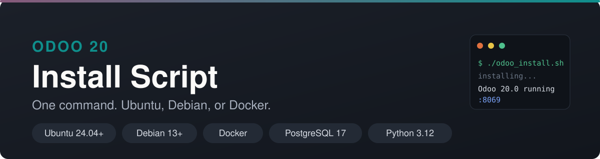
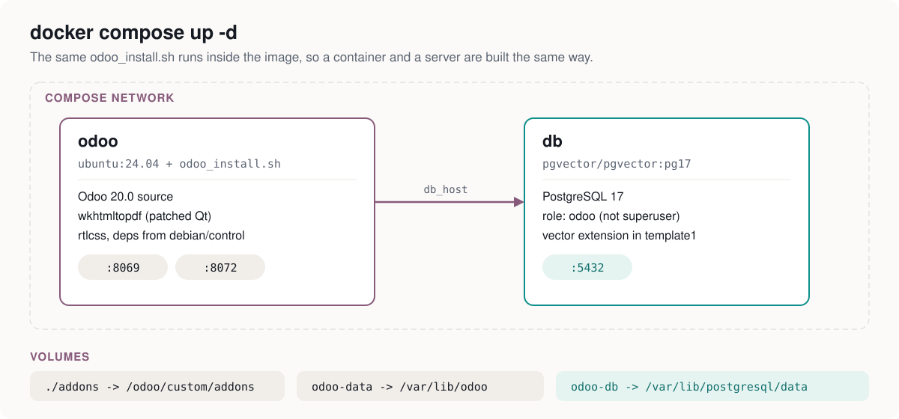

<p align="center">
  
</p>

<p align="center">
  <a href="#quick-start-docker"></a>
  <a href="#installation-bare-metal-or-vm"></a>
  <a href="#installation-bare-metal-or-vm"></a>
  
  
  
</p>

# Odoo 20 Install Script

Install **Odoo 20.0** on a server or in Docker with one command, on x86, x86_64 or ARM.

> **Ported from [Yenthe666/InstallScript](https://github.com/Yenthe666/InstallScript) 19.0.**
> All credit for the original script goes to [Yenthe Van Ginneken](https://github.com/Yenthe666),
> which itself builds on the install script by
> [André Schenkels](https://github.com/aschenkels-ictstudio/openerp-install-scripts).
> This repository is the Odoo 20.0 port of that work, kept MIT licensed.
> The changes were also submitted upstream as
> [Yenthe666/InstallScript#473](https://github.com/Yenthe666/InstallScript/pull/473).

---

## Quick start (Docker)

The Docker image runs **the same `odoo_install.sh`** inside `ubuntu:24.04`, so a container
and a server are built identically — no second code path to maintain.

```bash
git clone https://github.com/minaonlyone/odoo-install-script.git
cd odoo-install-script/docker
docker compose up -d
```

Open <http://localhost:8069> and create your first database. That is it.

<p align="center">
  
</p>

### Everyday Docker commands

```bash
docker compose up -d                 # start
docker compose logs -f odoo          # follow the Odoo log
docker compose restart odoo          # restart after adding a module
docker compose down                  # stop (keeps your data)
docker compose down -v               # stop and DELETE the database volume
docker compose build --no-cache odoo # rebuild the image from scratch
```

### Your own modules

Drop them in `docker/addons/`, which is mounted at `/odoo/custom/addons`:

```bash
cp -r my_module docker/addons/
docker compose restart odoo
```

Then in Odoo: **Apps ▸ Update Apps List**, search for your module and install it.

> Odoo skips an addons directory that contains no module, so keep at least one module in
> `docker/addons/` or the path drops off `addons_path` until you add one.

### Build options

Set these under `services.odoo.build.args` in `docker/docker-compose.yml`:

| Build arg | Default | What it does |
|---|---|---|
| `OE_VERSION` | `20.0` | Odoo branch to clone |
| `IS_ENTERPRISE` | `False` | Install Enterprise on top (see below) |
| `INSTALL_WKHTMLTOPDF` | `True` | Patched-Qt wkhtmltopdf for PDF reports |
| `INSTALL_PAPER_MUNCHER` | `False` | Odoo 20's new PDF engine (amd64 only) |

### Enterprise in Docker

Enterprise is **not** bundled and never will be. Cloning
[odoo/enterprise](https://github.com/odoo/enterprise) requires your own access as an
official Odoo partner. Without that access the clone fails and you can only run Community.

To build with Enterprise, give the build your GitHub credentials, for example:

```bash
cd docker
docker compose build \
  --build-arg IS_ENTERPRISE=True \
  --secret id=gh,env=GH_TOKEN odoo
```

and add a matching `RUN --mount=type=secret` git credential step to the `Dockerfile`, or
simply bind-mount an `enterprise` checkout you already have and point `addons_path` at it.
The script's behaviour is unchanged: no access, no Enterprise.

The compose file already uses the `pgvector/pgvector:pg17` image and creates the `vector`
extension in `template1`, which the Enterprise AI modules need.

---

## Installation (bare metal or VM)

### 1. Download

Ubuntu:
```bash
wget https://raw.githubusercontent.com/minaonlyone/odoo-install-script/main/odoo_install.sh
```

Debian:
```bash
wget https://raw.githubusercontent.com/minaonlyone/odoo-install-script/main/odoo_install_debian.sh
```

### 2. Make it executable and run it

```bash
chmod +x odoo_install.sh
sudo ./odoo_install.sh
```

### 3. Manage the service

```bash
sudo systemctl status odoo-server     # is it running?
sudo systemctl restart odoo-server    # restart
sudo journalctl -u odoo-server -f     # follow the log
sudo tail -f /var/log/odoo/odoo-server.log
```


## Which script do I use?

| Script | Target |
|---|---|
| `odoo_install.sh` | Ubuntu 24.04 LTS and newer |
| `odoo_install_debian.sh` | Debian 13 (trixie) and newer |

Both share the same logic and options; only the defaults differ (distribution codename,
certbot install method).

## Requirements for Odoo 20

Odoo 20 raised its minimum requirements. The scripts check these and abort with a clear
message instead of producing a broken install:

| | Odoo 19 | Odoo 20 |
|---|---|---|
| Python | 3.10+ | **3.12+** |
| PostgreSQL | 13+ | **16+** |
| `http_interface` default | `0.0.0.0` | **`127.0.0.1`** |

Because of the Python requirement, **Ubuntu 22.04 (Python 3.10) and Debian 12
(Python 3.11) can no longer run Odoo 20**. Use Ubuntu 24.04 LTS or Debian 13 or newer.

### The `http_interface` change

This is the one most likely to catch you out. Odoo 20 binds to `127.0.0.1` by default, so
a fresh install on a VPS is unreachable from anywhere but the machine itself. Odoo 19 even
warns about it in advance:

> `missing http_interface, using 0.0.0.0 by default, will change to 127.0.0.1 in 20.0`

These scripts write it explicitly: `0.0.0.0` on a plain install, `127.0.0.1` when Nginx is
installed in front of Odoo. Override with `HTTP_INTERFACE`.

## Configuration options

Open the script and edit the variables at the top.

| Option | Meaning |
|---|---|
| `OE_USER` | System user Odoo runs as. Default `odoo`. |
| `OE_VERSION` | Odoo version to install. Default `20.0`. |
| `OE_PORT` | HTTP port. Default `8069`. |
| `HTTP_INTERFACE` | Interface to bind. Empty = auto (`0.0.0.0`, or `127.0.0.1` with Nginx). |
| `GEVENT_PORT` | Websocket port (live chat, bus, notifications). Default `8072`. |
| `IS_ENTERPRISE` | `True` to install Enterprise on top. Requires access to `odoo/enterprise`. |
| `INSTALL_POSTGRESQL_PGDG` | Install PostgreSQL from postgresql.org instead of the distro. |
| `POSTGRESQL_VERSION` | PostgreSQL major version. Default `17`. Odoo 20 needs 16+. |
| `DEPENDENCIES_MODE` | `apt` (distribution packages, recommended) or `pip` (`requirements.txt`). |
| `DB_HOST` | `False` installs PostgreSQL locally. Set a hostname to use an external server instead (this is what Docker uses). |
| `DB_PORT` / `DB_USER` / `DB_PASSWORD` | Credentials for the external server. |
| `INSTALL_WKHTMLTOPDF` | Install wkhtmltopdf. Default `True`. |
| `INSTALL_PAPER_MUNCHER` | Install Paper Muncher, the new Odoo 20 PDF engine. amd64 only, opt-in. |
| `USE_SYSTEMD` | `False` to keep the legacy `/etc/init.d` service. |
| `GENERATE_RANDOM_PASSWORD` | Generate a random master password. Default `True`. |
| `OE_SUPERADMIN` | Master password when not generating a random one. |
| `INSTALL_NGINX` | Install and configure Nginx. Default `False`. |
| `WEBSITE_NAME` | Domain for the Nginx config. |
| `ENABLE_SSL` | Install certbot and enable HTTPS. Needs `INSTALL_NGINX` and a real `ADMIN_EMAIL`. |
| `ADMIN_EMAIL` | Email for the Let's Encrypt registration. |

## Dependency handling

By default the scripts install the Python dependencies from the **distribution packages**,
parsed out of Odoo's own `debian/control`. This is the method Odoo documents, and it avoids
fighting PEP 668 on Ubuntu 24.04.

Odoo's `debian/control` uses alternatives such as `python3-lxml-html-clean | python3-lxml`,
which `apt-get install` does not understand. The scripts resolve each one to the first
package that actually exists in the configured sources.

Set `DEPENDENCIES_MODE="pip"` to install from `requirements.txt` instead.

## PDF engines

Odoo 20 has a pluggable PDF engine. `base_report_wkhtmltox` is `auto_install`, so
**wkhtmltopdf stays the default**.

The scripts install the official `0.12.6.1-3` build that is patched against Qt, because the
build shipped by Ubuntu and Debian is not, and report headers and footers silently go
missing with it. The distribution package is only used as a fallback, with a warning.

To use [Paper Muncher](https://odoo.github.io/paper-muncher/) instead, set
`INSTALL_PAPER_MUNCHER="True"` and then:

1. Install the `base_report_paper_muncher` module in your database.
2. Set the `report.pdf_engine_default` system parameter to `paper-muncher`
   (Settings ‣ Technical ‣ System Parameters).

## Enterprise

Set `IS_ENTERPRISE="True"`. You need to be an official Odoo partner with access to
[github.com/odoo/enterprise](https://github.com/odoo/enterprise).

The script also installs `pgvector` and creates the `vector` extension in `template1`, which
the Enterprise AI modules need for RAG. It is created in `template1` on purpose: the Odoo
PostgreSQL role is deliberately **not** a superuser, so it cannot run `CREATE EXTENSION`
itself, and inheriting from `template1` means every new database gets it.

## Nginx and the websocket

If you enable Nginx, the generated config proxies `/websocket` to the gevent port with the
`Upgrade` / `Connection` headers the Odoo bus requires. `longpolling_port` was removed in
Odoo 20 and the config file writes `gevent_port` instead.

If you run Odoo behind Nginx you should also configure workers. See the
[Odoo deployment guide](https://www.odoo.com/documentation/20.0/administration/on_premise/deploy.html).

## Testing

`test_install/` contains a Docker setup that runs either script in a clean container:

```bash
cd test_install
docker compose build
docker compose up -d
docker compose exec odoo20-ubuntu bash -c 'cp /opt/odoo-install/odoo_install.sh /root/run.sh && chmod +x /root/run.sh && /root/run.sh'
```

This port was verified end to end on Ubuntu 24.04 and Debian 13 (arm64) and on amd64 for
Paper Muncher: PostgreSQL 17 from PGDG, all 48 dependencies resolved from `debian/control`,
wkhtmltopdf `0.12.6.1 (with patched qt)`, pgvector 0.8.6, 868 Enterprise modules, and
Odoo 20.0 booting and serving the web client in both Community (53 apps) and Enterprise
(80 apps) mode.

## Minimal server requirements

Use at least **2 GB of RAM**. A Linux instance typically uses 300–500 MB and the rest has to
be split between Odoo, PostgreSQL and everything else. Installs on 1 GB machines are known
to fail.

## License

MIT. See [LICENSE](LICENSE). Original copyright Yenthe V.G, with the Odoo 20 port
copyright added alongside it.
